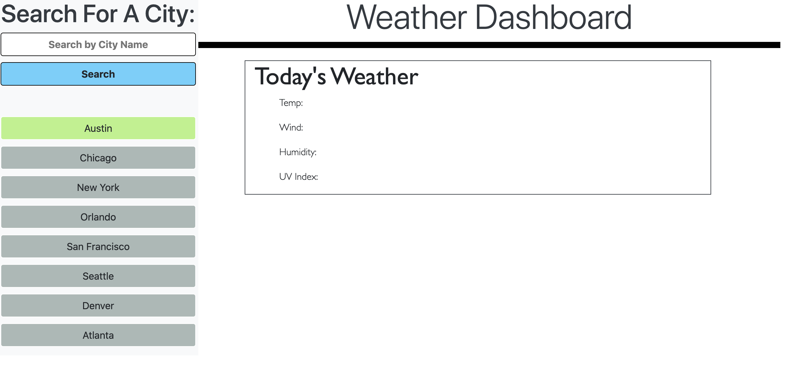

# Challenge-06-weather-dashboard

Class: UCB-VIRT-BO-FSF-PT-03-2021-U-B-MW

Challenge: Challenge-06 Server-Side APIs: Weather Dashboard

## Purpose

This code repository is a deployment of original HTML/ CSS/ JavaScript that allows users to interact with the webpage, to find the weather & corresponding forecasts of locations they choose in the United States.

## Built With
* HTML
* CSS
* JavaScript
* Bootstrap
* REST API

## Contribution
Made by Stefan Hall

### 2021 Challenge-02 Advanced CSS Portfolio

Link to Deployed Application: https://surferstef.github.io/weather-dashboard/

## Screenshot
